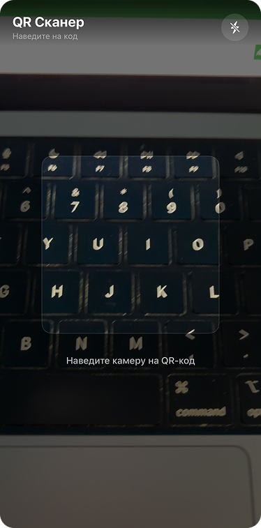
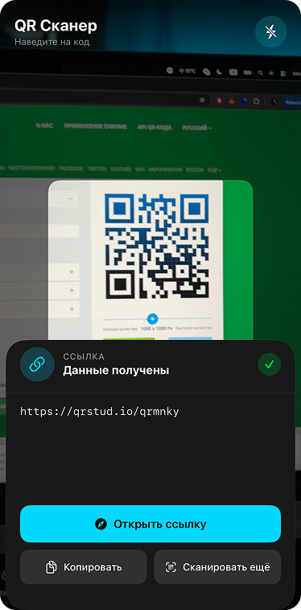
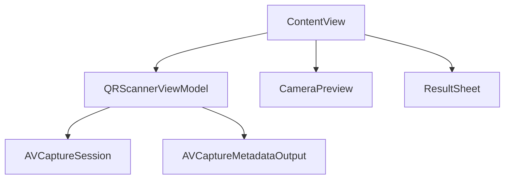

# 📷 QRScanner - iOS App

<div align="center">
  
  
  
  
</div>

<p align="center">
  <strong>Минималистичный QR-сканер с использованием SwiftUI и AVFoundation</strong>
</p>

<div align="center">
  
  
  
</div>

---

## ✨ Основные возможности

| Функция | Описание |
|---------|----------|
| 📷 **Сканирование QR-кодов** | Использование камеры устройства через AVFoundation |
| ⚡ **Мгновенное распознавание** | Быстрое получение данных после наведения |
| 🔗 **Обработка ссылок** | Возможность открыть ссылку в браузере |
| 📋 **Копирование результата** | Копирование отсканированного текста |
| 🔄 **Повторное сканирование** | Быстрое возвращение к камере |
| 🎨 **Кастомный Overlay** | Визуальная рамка наведения на QR-код |

---

## 🏗️ Архитектура

Проект реализован с использованием архитектурного паттерна **MVVM (Model-View-ViewModel)**.



### 🔧 Технологический стек:
- **UI Framework**: SwiftUI
- **Architecture**: MVVM
- **Camera & Scanning**: AVFoundation

---

## 📁 Структура проекта

```
QRScanner/
├── QRScannerApp.swift          # Точка входа приложения
├── ContentView.swift           # Главный экран
├── QRScannerViewModel.swift    # Логика сканирования (MVVM)
├── CameraPreview.swift         # UIViewRepresentable для камеры
├── ViewFinderOverlay.swift     # Overlay с рамкой наведения
├── ResultSheet.swift           # Модальное окно результата
└── Assets.xcassets             # Ресурсы
```

---

## 🎓 Обучающий проект

Проект реализован по видеоуроку:

📺 **YouTube:**  
[SwiftUI QR Scanner Tutorial](https://youtu.be/ZT4N7LxutiI?si=dH5Lkmvn53BpeXdI)

В процессе реализации:
- Освоена интеграция AVFoundation в SwiftUI
- Реализован UIViewRepresentable для камеры
- Настроена работа с AVCaptureSession
- Обработаны разрешения на доступ к камере
- Реализована реактивная логика через ViewModel

---

## 🚀 Быстрый старт

### Требования
- **iOS**: 16.0+
- **Xcode**: 15.0+
- **Swift**: 5.9+

### Установка

```bash
git clone https://github.com/YourUsername/QRScanner.git
cd QRScanner
open QRScanner.xcodeproj
```

⚠️ Не забудьте добавить в `Info.plist`:

```xml
<key>NSCameraUsageDescription</key>
<string>Приложению требуется доступ к камере для сканирования QR-кодов</string>
```

---

## 📖 Использование

1. Запустите приложение  
2. Наведите камеру на QR-код  
3. Дождитесь автоматического распознавания  
4. В открывшемся окне:
   - 🔗 Откройте ссылку
   - 📋 Скопируйте данные
   - 🔄 Отсканируйте снова  

---

## 🔐 Разрешения

Приложение использует:
- 📷 Камеру (AVFoundation)

Никакие данные не сохраняются и не передаются на сервер.

---

## 📄 Лицензия

Проект создан в образовательных целях. Распространяется под лицензией MIT.

---
<div align="center"> <p>⭐ Если вам понравилась реализация, не забудьте поставить звезду!</p> </div>
